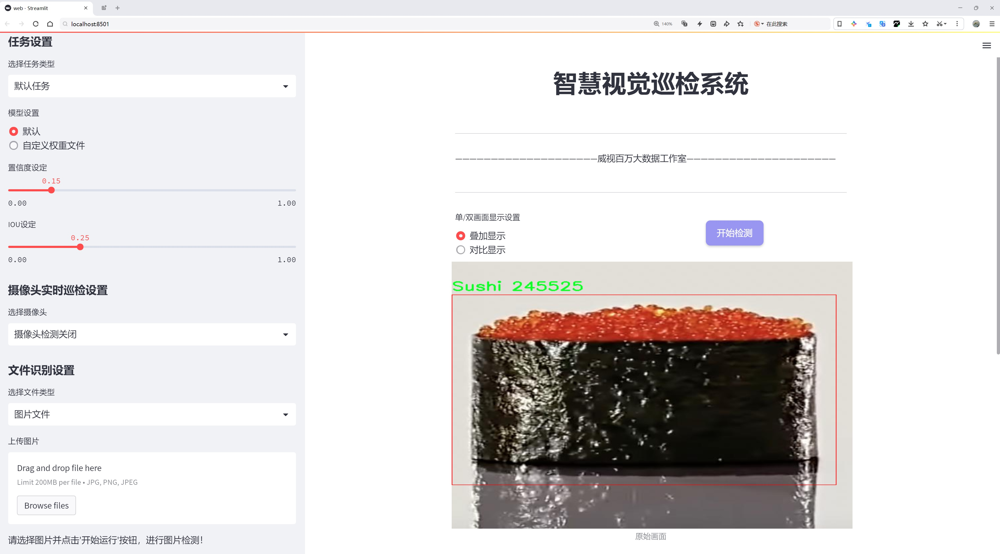
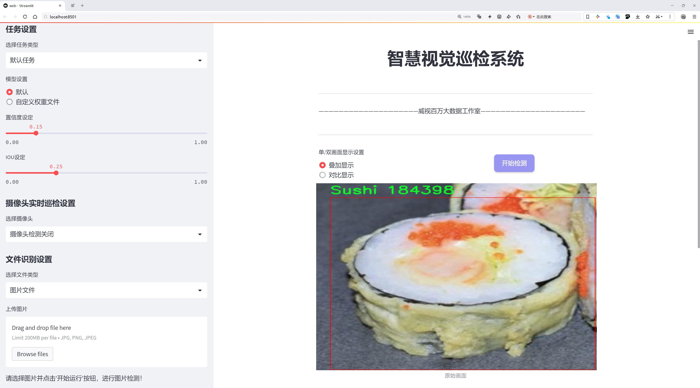
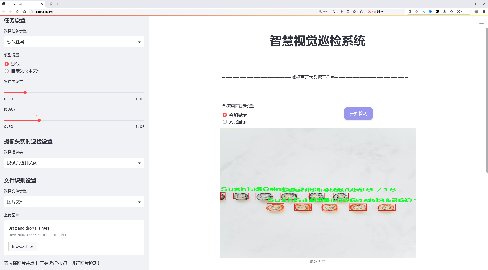
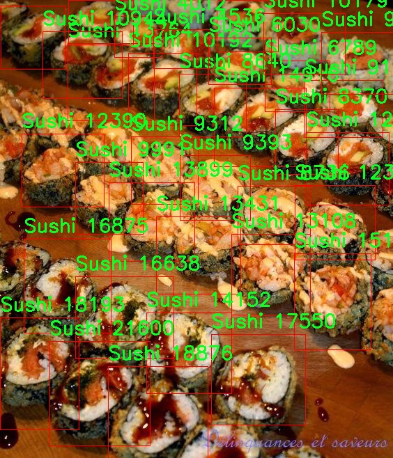
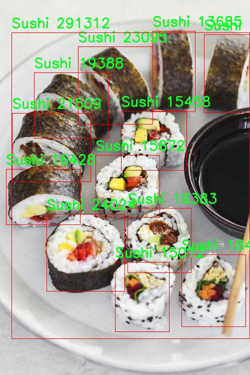
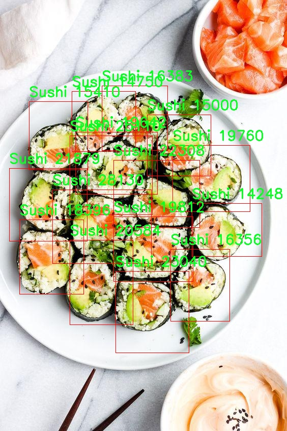
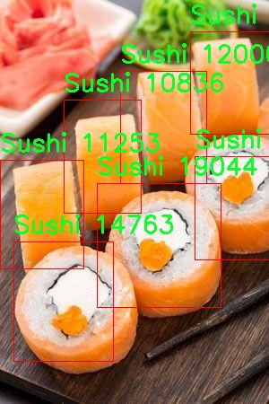
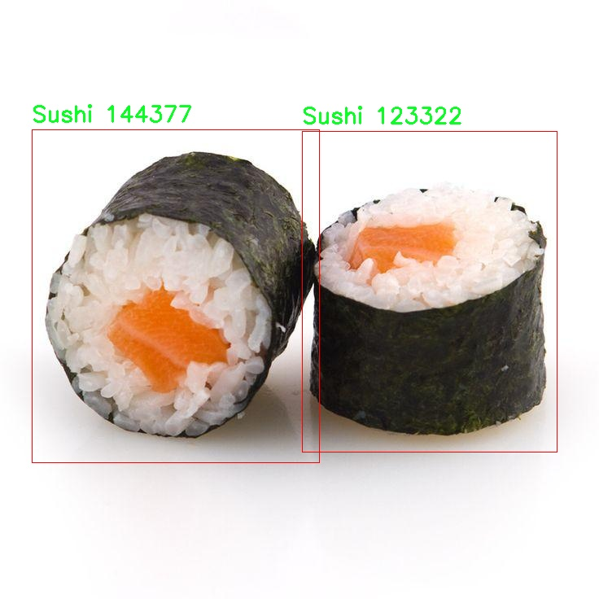

# 寿司检测检测系统源码分享
 # [一条龙教学YOLOV8标注好的数据集一键训练_70+全套改进创新点发刊_Web前端展示]

### 1.研究背景与意义

项目参考[AAAI Association for the Advancement of Artificial Intelligence](https://gitee.com/qunmasj/projects)

项目来源[AACV Association for the Advancement of Computer Vision](https://kdocs.cn/l/cszuIiCKVNis)

研究背景与意义

随着全球化的加速和饮食文化的多样化，寿司作为一种独特的日本传统美食，逐渐在世界范围内获得了广泛的认可和喜爱。寿司不仅因其独特的口味和丰富的营养价值而受到青睐，更因其制作工艺和文化内涵而被视为一种艺术形式。然而，随着寿司消费的增加，市场上出现了大量的仿制品和低质量产品，这不仅影响了消费者的选择，也对寿司行业的品牌形象和市场秩序造成了冲击。因此，建立一个高效、准确的寿司检测系统显得尤为重要。

在这一背景下，计算机视觉技术的迅猛发展为食品检测提供了新的解决方案。YOLO（You Only Look Once）系列模型作为一种先进的目标检测算法，以其高效性和准确性在多个领域得到了广泛应用。YOLOv8作为该系列的最新版本，进一步提升了目标检测的速度和精度，适用于实时检测任务。基于YOLOv8的寿司检测系统，不仅能够快速识别寿司的种类，还能有效区分真伪，从而为消费者提供可靠的选择依据。

本研究的核心在于利用改进的YOLOv8模型，构建一个专门针对寿司的检测系统。我们使用的数据集包含2500张图像，涵盖了两个主要类别：寿司和仿制品。这一数据集的构建不仅为模型的训练提供了丰富的样本，也为后续的性能评估奠定了基础。通过对这些图像的分析和处理，模型能够学习到寿司的特征，从而在实际应用中实现高效的识别和分类。

此外，寿司检测系统的研究意义不仅体现在技术层面，更在于其对行业发展的推动作用。通过准确的寿司检测，消费者能够更好地识别高质量的产品，增强对品牌的信任感，从而促进市场的健康发展。同时，该系统的推广应用还可以为餐饮行业提供数据支持，帮助商家优化产品质量和提升服务水平，进而增强竞争力。

综上所述，基于改进YOLOv8的寿司检测系统的研究，不仅具有重要的学术价值，也对实际应用具有深远的影响。通过这一研究，我们希望能够为食品安全和质量控制提供新的思路和方法，推动寿司行业的可持续发展。随着技术的不断进步和应用的深入，未来的寿司检测系统将能够实现更高的智能化水平，为消费者和行业带来更多的便利和保障。

### 2.图片演示







##### 注意：由于此博客编辑较早，上面“2.图片演示”和“3.视频演示”展示的系统图片或者视频可能为老版本，新版本在老版本的基础上升级如下：（实际效果以升级的新版本为准）

  （1）适配了YOLOV8的“目标检测”模型和“实例分割”模型，通过加载相应的权重（.pt）文件即可自适应加载模型。

  （2）支持“图片识别”、“视频识别”、“摄像头实时识别”三种识别模式。

  （3）支持“图片识别”、“视频识别”、“摄像头实时识别”三种识别结果保存导出，解决手动导出（容易卡顿出现爆内存）存在的问题，识别完自动保存结果并导出到tempDir中。

  （4）支持Web前端系统中的标题、背景图等自定义修改，后面提供修改教程。

  另外本项目提供训练的数据集和训练教程,暂不提供权重文件（best.pt）,需要您按照教程进行训练后实现图片演示和Web前端界面演示的效果。

### 3.视频演示

[3.1 视频演示](https://www.bilibili.com/video/BV1E6s6eNE48/)

### 4.数据集信息展示

##### 4.1 本项目数据集详细数据（类别数＆类别名）

nc: 2
names: ['-', 'Sushi']


##### 4.2 本项目数据集信息介绍

数据集信息展示

在现代计算机视觉领域，数据集的质量和多样性对模型的训练效果至关重要。本次研究中，我们采用了名为“sushi_clone”的数据集，旨在改进YOLOv8的寿司检测系统。该数据集专门为寿司检测任务而设计，提供了丰富的样本和多样化的场景，以确保模型在实际应用中的鲁棒性和准确性。

“sushi_clone”数据集包含两个类别，分别为“无”（-）和“寿司”（Sushi）。虽然类别数量相对较少，但每个类别的样本都经过精心挑选和标注，确保了数据的高质量和准确性。特别是在“寿司”类别中，数据集涵盖了多种类型的寿司，如握寿司、卷寿司和散寿司等。这种多样性使得模型能够学习到不同寿司形态的特征，从而提高检测的精度和召回率。

在数据集的构建过程中，研究团队特别注重样本的多样性和代表性。数据集中的图像来源于不同的拍摄环境，包括餐厅、家庭厨房以及超市等场景。这些图像不仅展示了寿司的多种摆放方式，还考虑了不同的光照条件和背景复杂度。这种设计理念旨在模拟真实世界中可能遇到的各种情况，以提高模型在实际应用中的适应能力。

此外，数据集中的每一张图像都附带了详细的标注信息，包括寿司的位置信息和类别标签。这些标注信息为模型的训练提供了必要的监督信号，使得YOLOv8能够在学习过程中逐步优化其检测能力。通过不断迭代训练，模型能够更好地识别和定位寿司，进而提升整体检测性能。

在数据预处理阶段，我们对“sushi_clone”数据集进行了多种增强操作，如随机裁剪、旋转、缩放和颜色调整等。这些操作不仅增加了数据集的多样性，还有效地提高了模型的泛化能力。通过这种方式，模型能够在面对不同的输入图像时，依然保持较高的检测准确率。

总的来说，“sushi_clone”数据集为改进YOLOv8的寿司检测系统提供了坚实的基础。通过精心设计的类别和丰富的样本，研究团队希望能够训练出一个高效、准确的寿司检测模型，以满足实际应用中的需求。随着数据集的不断扩展和模型的优化，我们期待在未来的研究中取得更为显著的成果，为计算机视觉领域的发展贡献一份力量。











### 5.全套项目环境部署视频教程（零基础手把手教学）

[5.1 环境部署教程链接（零基础手把手教学）](https://www.ixigua.com/7404473917358506534?logTag=c807d0cbc21c0ef59de5)


[5.2 安装Python虚拟环境创建和依赖库安装视频教程链接（零基础手把手教学）](https://www.ixigua.com/7404474678003106304?logTag=1f1041108cd1f708b01a)

### 6.手把手YOLOV8训练视频教程（零基础小白有手就能学会）

[6.1 手把手YOLOV8训练视频教程（零基础小白有手就能学会）](https://www.ixigua.com/7404477157818401292?logTag=d31a2dfd1983c9668658)

### 7.70+种全套YOLOV8创新点代码加载调参视频教程（一键加载写好的改进模型的配置文件）

[7.1 70+种全套YOLOV8创新点代码加载调参视频教程（一键加载写好的改进模型的配置文件）](https://www.ixigua.com/7404478314661806627?logTag=29066f8288e3f4eea3a4)

### 8.70+种全套YOLOV8创新点原理讲解（非科班也可以轻松写刊发刊，V10版本正在科研待更新）

由于篇幅限制，每个创新点的具体原理讲解就不一一展开，具体见下列网址中的创新点对应子项目的技术原理博客网址【Blog】：


[8.1 70+种全套YOLOV8创新点原理讲解链接](https://gitee.com/qunmasj/good)

### 9.系统功能展示（检测对象为举例，实际内容以本项目数据集为准）

图9.1.系统支持检测结果表格显示

  图9.2.系统支持置信度和IOU阈值手动调节

  图9.3.系统支持自定义加载权重文件best.pt(需要你通过步骤5中训练获得)

  图9.4.系统支持摄像头实时识别

  图9.5.系统支持图片识别

  图9.6.系统支持视频识别

  图9.7.系统支持识别结果文件自动保存

  图9.8.系统支持Excel导出检测结果数据


### 10.原始YOLOV8算法原理

原始YOLOv8算法原理

YOLOv8作为YOLO系列的最新版本，继承并扩展了前几代模型的设计理念，旨在实现更高效的目标检测。其核心原理围绕着将目标检测任务转化为一个回归问题，利用深度学习技术通过单一的神经网络模型同时预测目标的位置和类别。与之前的版本相比，YOLOv8在模型架构、特征提取和目标检测方式上进行了显著的改进，尤其是在处理不同尺度的目标时表现出色。

YOLOv8的网络结构主要由三部分组成：Backbone、Neck和Head。Backbone部分采用了CSPDarknet结构，旨在高效提取图像特征。CSPDarknet通过将网络分为两个部分，每个部分包含多个残差块，能够有效捕捉到输入图像中的重要信息。与YOLOv5相比，YOLOv8引入了C2f模块替代了C3模块，C2f模块的设计允许输入特征图被分成两个分支，每个分支经过卷积层进行降维处理。通过这种方式，YOLOv8能够更好地保持梯度流信息，提升特征图的维度，最终形成更为丰富的特征表示。

在特征提取过程中，YOLOv8还引入了快速空间金字塔池化（SPPF）结构，旨在提取不同尺度的特征。这一设计不仅有效减少了模型的参数量和计算量，还显著提高了特征提取的效率。通过这种多尺度特征提取，YOLOv8能够在处理不同大小的目标时，保持较高的检测精度。

Neck部分采用了特征金字塔网络（FPN）与路径聚合网络（PAN）的结合，进一步增强了特征的融合与传递能力。FPN通过构建多层次的特征图，使得不同尺度的特征能够有效结合，而PAN则通过路径聚合的方式，确保了特征信息在不同层次间的高效流动。这种设计使得YOLOv8在面对复杂场景时，能够更好地进行目标检测，尤其是在多目标检测的任务中，表现得尤为突出。

在Head部分，YOLOv8采用了解耦头的设计，将分类和回归任务分开处理。传统的目标检测模型通常将这两个任务耦合在一起，导致在复杂场景下可能出现定位不准或分类错误的问题。而通过解耦设计，YOLOv8能够让每个任务更加专注于自身的目标，从而提高整体的检测精度。这种创新的设计思路为YOLOv8在目标检测领域的应用提供了更大的灵活性和适应性。

值得一提的是，YOLOv8采用了无锚框（Anchor-Free）的检测方式，直接预测目标的中心点和宽高比例。这一方法的引入，显著简化了目标检测的过程，减少了对锚框的依赖，避免了传统方法中锚框选择和调整的繁琐问题。通过这种回归方式，YOLOv8能够更快地聚焦于目标位置的邻近点，使得预测框更接近于实际的边界框区域，从而提高了检测速度和准确度。

总的来说，YOLOv8在设计上融合了多种先进的深度学习技术，通过高效的特征提取、灵活的特征融合以及创新的检测方式，极大地提升了目标检测的性能。与前代模型相比，YOLOv8在训练时间和检测精度上都有显著提升，同时其轻量化的模型权重使得其能够在各种嵌入式设备上高效运行。这一系列的改进，使得YOLOv8在智能监控、自动驾驶、人脸识别等多种应用场景中展现出广泛的适用性和优越的性能。

在目标检测领域，YOLOv8的出现不仅是技术上的一次飞跃，更是对目标检测方法论的一次深刻反思与创新。通过对模型结构的不断优化与创新，YOLOv8不仅实现了更高的检测精度和更快的检测速度，也为未来的目标检测研究提供了新的思路与方向。随着YOLOv8的推广与应用，目标检测技术将更加成熟，为各行各业的智能化发展注入新的动力。


### 11.项目核心源码讲解（再也不用担心看不懂代码逻辑）

#### 11.1 ui.py

以下是经过精简和注释的核心代码：

```python
import sys
import subprocess
from QtFusion.path import abs_path

def run_script(script_path):
    """
    使用当前 Python 环境运行指定的脚本。

    Args:
        script_path (str): 要运行的脚本路径
    """
    # 获取当前 Python 解释器的路径
    python_path = sys.executable

    # 构建运行命令，使用 streamlit 运行指定的脚本
    command = f'"{python_path}" -m streamlit run "{script_path}"'

    # 执行命令并等待其完成
    result = subprocess.run(command, shell=True)
    
    # 检查命令执行结果，如果返回码不为0，表示出错
    if result.returncode != 0:
        print("脚本运行出错。")

# 主程序入口
if __name__ == "__main__":
    # 获取要运行的脚本的绝对路径
    script_path = abs_path("web.py")

    # 调用函数运行脚本
    run_script(script_path)
```

### 代码分析和注释：

1. **导入模块**：
   - `sys`：用于访问与 Python 解释器相关的变量和函数。
   - `subprocess`：用于执行外部命令。
   - `abs_path`：从 `QtFusion.path` 模块导入的函数，用于获取文件的绝对路径。

2. **`run_script` 函数**：
   - 功能：接受一个脚本路径，使用当前 Python 环境运行该脚本。
   - 参数：`script_path`，需要运行的脚本的路径。
   - 获取当前 Python 解释器的路径，构建运行命令。
   - 使用 `subprocess.run` 执行命令，并检查返回码以判断脚本是否成功运行。

3. **主程序入口**：
   - 通过 `if __name__ == "__main__":` 确保只有在直接运行该脚本时才会执行以下代码。
   - 使用 `abs_path` 获取 `web.py` 的绝对路径，并调用 `run_script` 函数运行该脚本。 

此代码的核心功能是通过当前 Python 环境运行指定的脚本，并提供错误处理。

这个文件名为 `ui.py`，其主要功能是通过当前的 Python 环境来运行一个指定的脚本，具体是使用 Streamlit 框架来启动一个 Web 应用。

首先，文件导入了几个必要的模块，包括 `sys`、`os` 和 `subprocess`。其中，`sys` 模块用于访问与 Python 解释器相关的变量和函数，`os` 模块提供了与操作系统交互的功能，而 `subprocess` 模块则用于生成新的进程、连接到它们的输入/输出/错误管道，并获取它们的返回码。

接着，文件中定义了一个名为 `run_script` 的函数，该函数接受一个参数 `script_path`，表示要运行的脚本的路径。在函数内部，首先通过 `sys.executable` 获取当前 Python 解释器的路径。然后，构建一个命令字符串，使用 Streamlit 的 `run` 命令来运行指定的脚本。这里使用了 `subprocess.run` 方法来执行这个命令，并且通过 `shell=True` 选项允许在 shell 中执行命令。

在执行命令后，函数检查返回的结果码。如果返回码不为零，表示脚本运行过程中出现了错误，程序会打印出“脚本运行出错。”的提示信息。

最后，在文件的主程序部分（即 `if __name__ == "__main__":` 语句块中），指定了要运行的脚本路径，这里是通过 `abs_path` 函数获取的 `web.py` 的绝对路径。然后调用 `run_script` 函数来执行这个脚本。

总体来看，这个文件的作用是为一个 Streamlit 应用提供一个启动入口，通过调用指定的 Python 脚本来启动 Web 应用。

#### 11.2 70+种YOLOv8算法改进源码大全和调试加载训练教程（非必要）\ultralytics\hub\session.py

以下是代码中最核心的部分，并附上详细的中文注释：

```python
import signal
import sys
from pathlib import Path
from time import sleep
import requests
from ultralytics.hub.utils import HUB_API_ROOT, HUB_WEB_ROOT, smart_request
from ultralytics.utils import LOGGER, __version__, checks, is_colab
from ultralytics.utils.errors import HUBModelError

AGENT_NAME = f'python-{__version__}-colab' if is_colab() else f'python-{__version__}-local'

class HUBTrainingSession:
    """
    HUB训练会话类，用于管理Ultralytics HUB YOLO模型的初始化、心跳和检查点。
    """

    def __init__(self, url):
        """
        初始化HUBTrainingSession，使用提供的模型标识符。

        参数:
            url (str): 用于初始化HUB训练会话的模型标识符，可以是URL字符串或特定格式的模型键。

        异常:
            ValueError: 如果提供的模型标识符无效。
            ConnectionError: 如果连接全局API密钥不被支持。
        """
        from ultralytics.hub.auth import Auth

        # 解析输入的URL
        if url.startswith(f'{HUB_WEB_ROOT}/models/'):
            url = url.split(f'{HUB_WEB_ROOT}/models/')[-1]
        if [len(x) for x in url.split('_')] == [42, 20]:
            key, model_id = url.split('_')
        elif len(url) == 20:
            key, model_id = '', url
        else:
            raise HUBModelError(f"model='{url}' not found. Check format is correct.")

        # 授权
        auth = Auth(key)
        self.agent_id = None  # 标识与服务器通信的实例
        self.model_id = model_id
        self.model_url = f'{HUB_WEB_ROOT}/models/{model_id}'
        self.api_url = f'{HUB_API_ROOT}/v1/models/{model_id}'
        self.auth_header = auth.get_auth_header()
        self.rate_limits = {'metrics': 3.0, 'ckpt': 900.0, 'heartbeat': 300.0}  # API调用的速率限制（秒）
        self.timers = {}  # 速率限制计时器
        self.metrics_queue = {}  # 模型指标队列
        self.model = self._get_model()  # 获取模型数据
        self.alive = True  # 心跳循环是否活跃
        self._start_heartbeat()  # 启动心跳
        self._register_signal_handlers()  # 注册信号处理器
        LOGGER.info(f'查看模型: {self.model_url} 🚀')

    def _register_signal_handlers(self):
        """注册信号处理器以优雅地处理终止信号。"""
        signal.signal(signal.SIGTERM, self._handle_signal)
        signal.signal(signal.SIGINT, self._handle_signal)

    def _handle_signal(self, signum, frame):
        """
        处理终止信号，防止在Colab上终止后发送心跳。

        参数:
            signum: 信号编号
            frame: 当前的栈帧（未使用）
        """
        if self.alive:
            LOGGER.info('收到终止信号! ❌')
            self._stop_heartbeat()  # 停止心跳
            sys.exit(signum)  # 退出程序

    def _stop_heartbeat(self):
        """终止心跳循环。"""
        self.alive = False

    def upload_metrics(self):
        """上传模型指标到Ultralytics HUB。"""
        payload = {'metrics': self.metrics_queue.copy(), 'type': 'metrics'}
        smart_request('post', self.api_url, json=payload, headers=self.auth_header)

    def _get_model(self):
        """从Ultralytics HUB获取并返回模型数据。"""
        api_url = f'{HUB_API_ROOT}/v1/models/{self.model_id}'

        try:
            response = smart_request('get', api_url, headers=self.auth_header)
            data = response.json().get('data', None)

            if data.get('status', None) == 'trained':
                raise ValueError('模型已训练并上传。')

            if not data.get('data', None):
                raise ValueError('数据集可能仍在处理，请稍后再试。')

            self.model_id = data['id']  # 更新模型ID

            # 根据模型状态设置训练参数
            if data['status'] == 'new':
                self.train_args = {
                    'batch': data['batch_size'],
                    'epochs': data['epochs'],
                    'imgsz': data['imgsz'],
                    'patience': data['patience'],
                    'device': data['device'],
                    'cache': data['cache'],
                    'data': data['data']}
                self.model_file = data.get('cfg') or data.get('weights')
                self.model_file = checks.check_yolov5u_filename(self.model_file)
            elif data['status'] == 'training':
                self.train_args = {'data': data['data'], 'resume': True}
                self.model_file = data['resume']

            return data
        except requests.exceptions.ConnectionError as e:
            raise ConnectionRefusedError('错误: HUB服务器未在线，请稍后再试。') from e

    @threaded
    def _start_heartbeat(self):
        """开始一个线程心跳循环，向Ultralytics HUB报告代理状态。"""
        while self.alive:
            r = smart_request('post',
                              f'{HUB_API_ROOT}/v1/agent/heartbeat/models/{self.model_id}',
                              json={'agent': AGENT_NAME, 'agentId': self.agent_id},
                              headers=self.auth_header)
            self.agent_id = r.json().get('data', {}).get('agentId', None)  # 更新代理ID
            sleep(self.rate_limits['heartbeat'])  # 根据速率限制等待
```

### 代码核心部分解释：
1. **HUBTrainingSession类**：该类负责管理与Ultralytics HUB的交互，包括模型的初始化、心跳监测和指标上传等功能。
2. **初始化方法**：解析模型标识符，进行授权，并获取模型数据。
3. **信号处理**：注册信号处理器以优雅地处理程序终止信号，确保在Colab环境中能够正确停止心跳。
4. **心跳机制**：通过线程定期向Ultralytics HUB发送心跳请求，报告代理的状态。
5. **模型数据获取**：从HUB获取模型数据，并根据模型的状态设置训练参数。

这个程序文件是Ultralytics YOLO模型的一个训练会话管理类，主要用于处理模型的初始化、心跳监测和检查点上传等功能。文件中首先导入了一些必要的库，包括信号处理、系统操作、路径处理、时间延迟和HTTP请求等。

在类`HUBTrainingSession`的构造函数中，接受一个模型标识符`url`，用于初始化训练会话。该标识符可以是一个URL字符串或特定格式的模型键。构造函数首先解析输入的URL，提取出模型的键和ID。如果格式不正确，则抛出一个自定义的异常`HUBModelError`。接着，使用认证类`Auth`进行身份验证，并设置了一些实例属性，包括模型的URL、API URL、认证头、速率限制等。然后，通过调用`_get_model`方法从Ultralytics HUB获取模型数据，并启动心跳监测。

`_register_signal_handlers`方法用于注册信号处理器，以便在接收到终止信号时能够优雅地处理程序的退出。`_handle_signal`方法在接收到信号时停止心跳并退出程序。`_stop_heartbeat`方法则用于终止心跳循环。

`upload_metrics`方法用于将模型的性能指标上传到Ultralytics HUB。`_get_model`方法负责从HUB获取模型数据，并根据模型的状态（如新模型、正在训练的模型等）设置训练参数和模型文件。

`upload_model`方法用于将模型的检查点上传到Ultralytics HUB，支持上传当前训练的权重文件，并可以标记该模型是否是最佳模型或最终模型。

最后，`_start_heartbeat`方法是一个线程化的心跳循环，定期向Ultralytics HUB报告代理的状态，确保与服务器的连接保持活跃。

整体来看，这个程序文件为YOLO模型的训练提供了一个结构化的会话管理方式，方便用户进行模型的训练、监控和上传。

#### 11.3 70+种YOLOv8算法改进源码大全和调试加载训练教程（非必要）\ultralytics\models\yolo\segment\__init__.py

```python
# 导入必要的模块
from .predict import SegmentationPredictor  # 导入分割预测器类
from .train import SegmentationTrainer      # 导入分割训练器类
from .val import SegmentationValidator      # 导入分割验证器类

# 定义模块的公开接口，允许外部访问这些类
__all__ = 'SegmentationPredictor', 'SegmentationTrainer', 'SegmentationValidator'
```

### 代码注释说明：
1. **导入模块**：
   - `from .predict import SegmentationPredictor`：从当前包的 `predict` 模块中导入 `SegmentationPredictor` 类，该类用于处理图像分割的预测任务。
   - `from .train import SegmentationTrainer`：从当前包的 `train` 模块中导入 `SegmentationTrainer` 类，该类用于训练分割模型。
   - `from .val import SegmentationValidator`：从当前包的 `val` 模块中导入 `SegmentationValidator` 类，该类用于验证分割模型的性能。

2. **定义公开接口**：
   - `__all__` 是一个特殊变量，用于定义模块的公共接口。它指定了在使用 `from module import *` 时，哪些类可以被导入。在这里，只有 `SegmentationPredictor`、`SegmentationTrainer` 和 `SegmentationValidator` 这三个类会被公开。

这个程序文件是YOLO（You Only Look Once）系列算法的一部分，具体是与分割（Segmentation）相关的模块。文件名表明这是一个关于YOLOv8算法改进的源码和调试加载训练的教程。文件的内容非常简洁，主要是导入和定义了一些类。

首先，文件的开头有一个注释，指出这是Ultralytics YOLO的代码，并且遵循AGPL-3.0许可证。这意味着该代码是开源的，用户可以自由使用和修改，但需要遵循相应的许可证条款。

接下来，文件通过相对导入的方式引入了三个类：`SegmentationPredictor`、`SegmentationTrainer`和`SegmentationValidator`。这些类分别用于不同的功能：

- `SegmentationPredictor`：这个类可能用于进行图像分割的预测，即在给定的图像上应用分割模型，输出分割结果。
- `SegmentationTrainer`：这个类用于训练分割模型，负责处理训练过程中的数据加载、模型更新等任务。
- `SegmentationValidator`：这个类用于验证模型的性能，通常是在训练后对模型进行评估，以检查其在未见数据上的表现。

最后，`__all__`变量定义了该模块的公共接口，指定了当使用`from module import *`时，哪些类会被导入。这里列出的三个类都是该模块的核心功能组件。

总的来说，这个文件是YOLOv8分割模块的初始化文件，负责导入和组织与图像分割相关的主要功能。

#### 11.4 train.py

以下是代码中最核心的部分，并附上详细的中文注释：

```python
class DetectionTrainer(BaseTrainer):
    """
    扩展自 BaseTrainer 类的检测模型训练类。
    用于训练 YOLO 检测模型。
    """

    def build_dataset(self, img_path, mode="train", batch=None):
        """
        构建 YOLO 数据集。

        参数:
            img_path (str): 包含图像的文件夹路径。
            mode (str): 模式，`train` 表示训练模式，`val` 表示验证模式。
            batch (int, optional): 批次大小，仅用于 `rect` 模式。默认为 None。
        """
        gs = max(int(de_parallel(self.model).stride.max() if self.model else 0), 32)
        return build_yolo_dataset(self.args, img_path, batch, self.data, mode=mode, rect=mode == "val", stride=gs)

    def get_dataloader(self, dataset_path, batch_size=16, rank=0, mode="train"):
        """构造并返回数据加载器。"""
        assert mode in ["train", "val"]  # 确保模式是训练或验证
        with torch_distributed_zero_first(rank):  # 在分布式环境中仅初始化一次数据集
            dataset = self.build_dataset(dataset_path, mode, batch_size)
        shuffle = mode == "train"  # 训练模式下打乱数据
        if getattr(dataset, "rect", False) and shuffle:
            LOGGER.warning("WARNING ⚠️ 'rect=True' 与 DataLoader shuffle 不兼容，设置 shuffle=False")
            shuffle = False
        workers = self.args.workers if mode == "train" else self.args.workers * 2  # 设置工作线程数
        return build_dataloader(dataset, batch_size, workers, shuffle, rank)  # 返回数据加载器

    def preprocess_batch(self, batch):
        """对一批图像进行预处理，包括缩放和转换为浮点数。"""
        batch["img"] = batch["img"].to(self.device, non_blocking=True).float() / 255  # 转换为浮点数并归一化
        if self.args.multi_scale:  # 如果启用多尺度
            imgs = batch["img"]
            sz = (
                random.randrange(self.args.imgsz * 0.5, self.args.imgsz * 1.5 + self.stride)
                // self.stride
                * self.stride
            )  # 随机选择图像大小
            sf = sz / max(imgs.shape[2:])  # 计算缩放因子
            if sf != 1:
                ns = [
                    math.ceil(x * sf / self.stride) * self.stride for x in imgs.shape[2:]
                ]  # 计算新的形状
                imgs = nn.functional.interpolate(imgs, size=ns, mode="bilinear", align_corners=False)  # 进行插值缩放
            batch["img"] = imgs  # 更新图像
        return batch

    def get_model(self, cfg=None, weights=None, verbose=True):
        """返回 YOLO 检测模型。"""
        model = DetectionModel(cfg, nc=self.data["nc"], verbose=verbose and RANK == -1)  # 创建检测模型
        if weights:
            model.load(weights)  # 加载权重
        return model

    def get_validator(self):
        """返回用于 YOLO 模型验证的 DetectionValidator。"""
        self.loss_names = "box_loss", "cls_loss", "dfl_loss"  # 定义损失名称
        return yolo.detect.DetectionValidator(
            self.test_loader, save_dir=self.save_dir, args=copy(self.args), _callbacks=self.callbacks
        )

    def plot_training_samples(self, batch, ni):
        """绘制带有注释的训练样本。"""
        plot_images(
            images=batch["img"],
            batch_idx=batch["batch_idx"],
            cls=batch["cls"].squeeze(-1),
            bboxes=batch["bboxes"],
            paths=batch["im_file"],
            fname=self.save_dir / f"train_batch{ni}.jpg",
            on_plot=self.on_plot,
        )
```

### 代码核心部分说明：
1. **DetectionTrainer 类**：这是一个用于训练 YOLO 检测模型的类，继承自 `BaseTrainer`。
2. **build_dataset 方法**：用于构建 YOLO 数据集，接受图像路径、模式和批次大小作为参数。
3. **get_dataloader 方法**：构造并返回数据加载器，确保在分布式环境中仅初始化一次数据集。
4. **preprocess_batch 方法**：对图像批次进行预处理，包括归一化和可选的多尺度调整。
5. **get_model 方法**：返回一个 YOLO 检测模型，可以选择加载预训练权重。
6. **get_validator 方法**：返回用于模型验证的检测验证器。
7. **plot_training_samples 方法**：绘制训练样本及其注释，便于可视化训练过程。

这个程序文件 `train.py` 是一个用于训练目标检测模型的脚本，主要基于 YOLO（You Only Look Once）架构。它扩展了 `BaseTrainer` 类，提供了一系列方法来构建数据集、加载数据、预处理图像、设置模型属性、获取模型、验证模型、记录损失、显示训练进度以及绘制训练样本和指标。

首先，文件导入了一些必要的库和模块，包括数学运算、随机数生成、深度学习框架 PyTorch 的神经网络模块，以及 Ultralytics 提供的各种工具和功能。Ultralytics 是一个专注于计算机视觉的开源项目，提供了 YOLO 模型的实现。

在 `DetectionTrainer` 类中，`build_dataset` 方法用于构建 YOLO 数据集。它接受图像路径、模式（训练或验证）和批量大小作为参数，并根据这些参数调用 `build_yolo_dataset` 函数来创建数据集。

`get_dataloader` 方法用于构建数据加载器，确保在分布式训练时只初始化一次数据集。它会根据模式设置是否打乱数据，并根据训练或验证模式调整工作线程的数量。

`preprocess_batch` 方法负责对输入的图像批次进行预处理，包括将图像缩放到合适的大小并转换为浮点数格式。该方法还支持多尺度训练，通过随机选择图像大小来增强模型的鲁棒性。

`set_model_attributes` 方法用于设置模型的属性，包括类别数量和类别名称，以便模型能够正确识别和分类目标。

`get_model` 方法返回一个 YOLO 检测模型，并可选择加载预训练权重。

`get_validator` 方法返回一个用于验证 YOLO 模型的验证器，并定义了损失名称，以便在训练过程中跟踪和记录损失。

`label_loss_items` 方法用于返回带有标签的训练损失项字典，方便在训练过程中进行监控。

`progress_string` 方法生成一个格式化的字符串，显示训练进度，包括当前的轮次、GPU 内存使用情况、损失值、实例数量和图像大小。

`plot_training_samples` 方法用于绘制训练样本及其标注，帮助可视化训练过程中的数据。

最后，`plot_metrics` 和 `plot_training_labels` 方法分别用于绘制训练过程中的指标和创建带标签的训练图，以便分析模型的性能和训练效果。

总体而言，这个文件提供了一个完整的框架，用于训练和验证基于 YOLO 的目标检测模型，涵盖了数据处理、模型设置、训练监控和结果可视化等多个方面。

#### 11.5 code\ultralytics\engine\validator.py

以下是代码中最核心的部分，并附上详细的中文注释：

```python
class BaseValidator:
    """
    BaseValidator类用于创建验证器的基类。

    属性:
        args (SimpleNamespace): 验证器的配置。
        dataloader (DataLoader): 用于验证的数据加载器。
        model (nn.Module): 要验证的模型。
        device (torch.device): 用于验证的设备。
        speed (dict): 包含预处理、推理、损失和后处理的处理时间。
        save_dir (Path): 保存结果的目录。
    """

    def __init__(self, dataloader=None, save_dir=None, args=None):
        """
        初始化BaseValidator实例。

        参数:
            dataloader (torch.utils.data.DataLoader): 用于验证的数据加载器。
            save_dir (Path, optional): 保存结果的目录。
            args (SimpleNamespace): 验证器的配置。
        """
        self.args = get_cfg(overrides=args)  # 获取配置
        self.dataloader = dataloader  # 数据加载器
        self.save_dir = save_dir or get_save_dir(self.args)  # 保存目录
        self.device = None  # 设备初始化
        self.speed = {"preprocess": 0.0, "inference": 0.0, "loss": 0.0, "postprocess": 0.0}  # 速度字典

    @smart_inference_mode()
    def __call__(self, model=None):
        """支持验证预训练模型或正在训练的模型。"""
        # 选择设备并准备模型
        self.device = select_device(self.args.device)  # 选择设备
        model = AutoBackend(model or self.args.model, device=self.device)  # 初始化模型
        model.eval()  # 设置模型为评估模式

        # 初始化进度条
        bar = TQDM(self.dataloader, desc="Validating", total=len(self.dataloader))
        
        for batch_i, batch in enumerate(bar):
            # 预处理
            batch = self.preprocess(batch)

            # 推理
            preds = model(batch["img"])

            # 更新指标
            self.update_metrics(preds, batch)

        # 打印结果
        self.print_results()

    def preprocess(self, batch):
        """预处理输入批次。"""
        return batch  # 这里可以添加具体的预处理逻辑

    def update_metrics(self, preds, batch):
        """根据预测和批次更新指标。"""
        pass  # 这里可以添加更新指标的逻辑

    def print_results(self):
        """打印模型预测的结果。"""
        pass  # 这里可以添加打印结果的逻辑
```

### 代码说明：
1. **BaseValidator类**：这是一个基类，用于创建模型验证器。它包含了模型验证所需的基本属性和方法。
2. **初始化方法**：在初始化时，配置参数、数据加载器和保存目录被设置。速度字典用于记录各个阶段的处理时间。
3. **调用方法**：这是验证的主要入口，支持验证预训练模型或正在训练的模型。它选择设备、初始化模型并设置为评估模式，然后通过数据加载器遍历每个批次进行验证。
4. **预处理方法**：该方法用于对输入批次进行预处理，具体的预处理逻辑可以在此处实现。
5. **更新指标方法**：根据模型的预测结果和实际批次更新性能指标，具体逻辑待实现。
6. **打印结果方法**：用于打印模型的预测结果，具体逻辑待实现。

这些核心部分提供了验证模型的基本框架，后续可以根据需要扩展具体的实现细节。

这个程序文件 `validator.py` 是 Ultralytics YOLO 框架的一部分，主要用于验证模型在测试集或验证集上的准确性。文件开头包含了使用说明，展示了如何通过命令行调用验证功能，并支持多种模型格式，包括 PyTorch、ONNX、TensorRT 等。

在代码中，首先导入了一些必要的库和模块，包括 JSON 处理、时间、路径操作、NumPy 和 PyTorch 等。接着，定义了一个名为 `BaseValidator` 的类，作为创建验证器的基类。该类包含多个属性，用于存储验证过程中的配置信息、数据加载器、模型、设备、统计信息等。

在 `__init__` 方法中，初始化了验证器的基本参数，包括数据加载器、保存结果的目录、进度条、配置参数等。通过调用 `get_cfg` 函数获取配置，并确保保存目录存在。此外，还对输入图像的大小进行了检查，确保其符合要求。

`__call__` 方法是验证器的核心，支持对预训练模型或正在训练的模型进行验证。根据是否传入训练器对象，设置训练模式和设备，并根据模型类型选择合适的推理方式。此方法还会初始化一些性能指标，处理数据加载，并在验证过程中记录每个批次的处理时间。

在验证循环中，程序会依次进行数据预处理、模型推理、损失计算和后处理，并更新性能指标。通过调用 `run_callbacks` 方法，可以在验证的不同阶段执行回调函数，以便进行自定义操作。

`match_predictions` 方法用于将模型的预测结果与真实标签进行匹配，使用 IoU（Intersection over Union）作为匹配标准。该方法可以选择是否使用 SciPy 库进行更精确的匹配。

此外，类中还定义了一些其他方法，包括添加回调、获取数据加载器、预处理和后处理、初始化和更新指标、获取统计信息等。这些方法为具体的验证实现提供了框架，但许多方法需要在子类中实现具体逻辑。

最后，文件中还包含了一些用于绘图和结果输出的占位符方法，虽然没有具体实现，但这些方法为后续的可视化和结果分析提供了接口。

总体而言，这个文件提供了一个结构化的方式来验证 YOLO 模型的性能，并为用户提供了灵活的配置和扩展能力。

#### 11.6 code\ultralytics\models\sam\__init__.py

以下是代码中最核心的部分，并附上详细的中文注释：

```python
# 导入所需的模块
from .model import SAM  # 从当前包的model模块中导入SAM类
from .predict import Predictor  # 从当前包的predict模块中导入Predictor类

# 定义模块的公开接口
__all__ = "SAM", "Predictor"  # 指定在使用from module import *时，允许导入的类
```

### 详细注释说明：
1. `from .model import SAM`：这行代码从当前包的`model`模块中导入了`SAM`类。`SAM`可能是一个与模型相关的类，通常用于定义或构建某种机器学习模型。

2. `from .predict import Predictor`：这行代码从当前包的`predict`模块中导入了`Predictor`类。`Predictor`通常用于执行预测操作，可能包含模型推理的相关方法。

3. `__all__ = "SAM", "Predictor"`：这行代码定义了模块的公开接口。当使用`from module import *`语句时，只会导入`__all__`中列出的类或函数。这有助于控制模块的命名空间，避免不必要的名称冲突。

这个程序文件是一个Python模块的初始化文件，通常用于定义模块的公共接口。在这个文件中，首先有一行注释，提到这是与Ultralytics YOLO相关的代码，并且该代码遵循AGPL-3.0许可证。

接下来，文件通过相对导入的方式引入了两个类：`SAM`和`Predictor`。这两个类分别来自于同一目录下的`model`和`predict`模块。`SAM`可能是一个与模型相关的类，而`Predictor`则可能是用于进行预测的类。

最后，`__all__`变量被定义为一个元组，包含了字符串`"SAM"`和`"Predictor"`。这个变量的作用是指定当使用`from module import *`语句时，应该导入哪些对象。在这里，只有`SAM`和`Predictor`这两个类会被导入，从而控制了模块的公共接口，避免不必要的内部实现细节被暴露给用户。

总体来说，这个文件的主要功能是组织和导出模块中的关键类，使得其他模块或脚本在使用时能够方便地访问这些类。

### 12.系统整体结构（节选）

### 整体功能和构架概括

该项目是一个基于YOLOv8算法的目标检测和分割框架，旨在提供高效的模型训练、验证和推理功能。项目的架构由多个模块组成，每个模块负责特定的功能，如模型训练、验证、数据处理和用户界面等。整体结构清晰，模块化设计使得代码易于维护和扩展。

主要功能包括：
- **模型训练**：提供训练目标检测和分割模型的功能，支持多种数据集和配置。
- **模型验证**：在训练后对模型进行评估，确保其在未见数据上的表现。
- **推理和预测**：使用训练好的模型进行目标检测和分割。
- **用户界面**：通过UI模块提供交互式操作，方便用户使用模型。
- **工具和实用功能**：包括错误处理、模型参数调优等辅助功能。

### 文件功能整理表

| 文件路径                                                                                          | 功能描述                                                                                       |
|---------------------------------------------------------------------------------------------------|-----------------------------------------------------------------------------------------------|
| `D:\tools\20240809\code\ui.py`                                                                    | 启动Streamlit Web应用，提供用户界面以运行YOLO模型。                                          |
| `D:\tools\20240809\code\70+种YOLOv8算法改进源码大全和调试加载训练教程（非必要）\ultralytics\hub\session.py` | 管理训练会话，包括模型初始化、心跳监测和检查点上传等功能。                                   |
| `D:\tools\20240809\code\70+种YOLOv8算法改进源码大全和调试加载训练教程（非必要）\ultralytics\models\yolo\segment\__init__.py` | 导入与YOLO分割相关的主要类，如`SegmentationPredictor`、`SegmentationTrainer`等。             |
| `D:\tools\20240809\code\train.py`                                                                 | 训练YOLO目标检测模型，处理数据集、模型设置、训练监控和结果可视化等功能。                     |
| `D:\tools\20240809\code\code\ultralytics\engine\validator.py`                                   | 验证模型性能，计算损失和准确性，支持多种模型格式的验证。                                     |
| `D:\tools\20240809\code\code\ultralytics\models\sam\__init__.py`                               | 初始化SAM模型模块，导入与SAM相关的主要类。                                                  |
| `D:\tools\20240809\code\70+种YOLOv8算法改进源码大全和调试加载训练教程（非必要）\ultralytics\nn\modules\head.py` | 定义YOLO模型的头部结构，处理输出层的设计和实现。                                            |
| `D:\tools\20240809\code\code\ultralytics\models\yolo\obb\__init__.py`                          | 初始化YOLO OBB（Oriented Bounding Box）模块，提供与方向性边界框相关的功能。                 |
| `D:\tools\20240809\code\70+种YOLOv8算法改进源码大全和调试加载训练教程（非必要）\ultralytics\models\yolo\classify\__init__.py` | 初始化YOLO分类模块，提供与图像分类相关的功能。                                              |
| `D:\tools\20240809\code\code\ultralytics\utils\errors.py`                                      | 定义错误处理和异常类，提供统一的错误管理机制。                                              |
| `D:\tools\20240809\code\70+种YOLOv8算法改进源码大全和调试加载训练教程（非必要）\ultralytics\utils\tuner.py` | 提供模型参数调优的工具和方法，帮助用户优化模型性能。                                        |
| `D:\tools\20240809\code\70+种YOLOv8算法改进源码大全和调试加载训练教程（非必要）\ultralytics\engine\trainer.py` | 定义训练过程的核心逻辑，包括数据加载、模型训练和监控等功能。                                |
| `D:\tools\20240809\code\code\ultralytics\utils\triton.py`                                      | 提供与Triton推理服务器集成的功能，支持模型的高效推理和部署。                                 |

以上表格总结了项目中各个文件的主要功能，展示了它们在整体架构中的作用。

注意：由于此博客编辑较早，上面“11.项目核心源码讲解（再也不用担心看不懂代码逻辑）”中部分代码可能会优化升级，仅供参考学习，完整“训练源码”、“Web前端界面”和“70+种创新点源码”以“13.完整训练+Web前端界面+70+种创新点源码、数据集获取”的内容为准。

### 13.完整训练+Web前端界面+70+种创新点源码、数据集获取


# [下载链接：https://mbd.pub/o/bread/ZpuZl5hs](https://mbd.pub/o/bread/ZpuZl5hs)